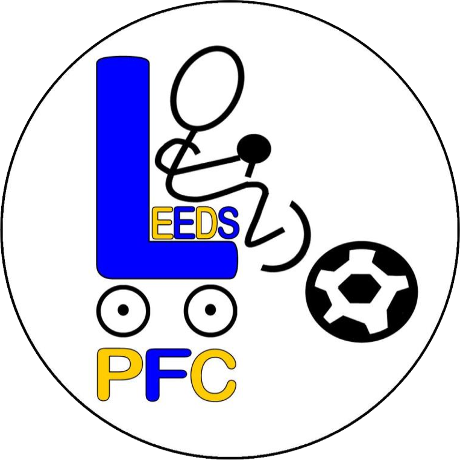

<!-- PROJECT LOGO -->
 

  

  <h3 align="center">Leeds Powerchair Football Club Bot</h3>

  

    A bot for the Leeds Powerchair Football Club Discord server.
  

<!-- TABLE OF CONTENTS -->

## Table of Contents

-   [About the Project](#about-the-project)
-   [Built With](#built-with)
-   [License](#license)
-   [Contact](#contact)

<!-- ABOUT THE PROJECT -->

## About The Project

After having a chat with the Leeds Powerchair Football Club coaches, I decided to make a bot for the Discord server. The bot uses the [TeamUp](https://teamup.com/) API in order to get the current weeks training sessions from the club's calendar and then posts them to the Discord server. Users can also confirm their attendance to the training sessions using the bot.

### Built With

-   [Discord.js](https://github.com/discordjs/discord.js)
-   [Typescript](https://github.com/microsoft/TypeScript)
-   [TeamUp API](https://apidocs.teamup.com)

## License

Distributed under the GNU General Public License v3.0 License. See `LICENSE` for more information.

## Contact

Jack Humphries - me@jackhumphries.io

Project Link: [https://github.com/JackHumphries9/leeds-pfc-bot](https://github.com/JackHumphries9/leeds-pfc-bot)
